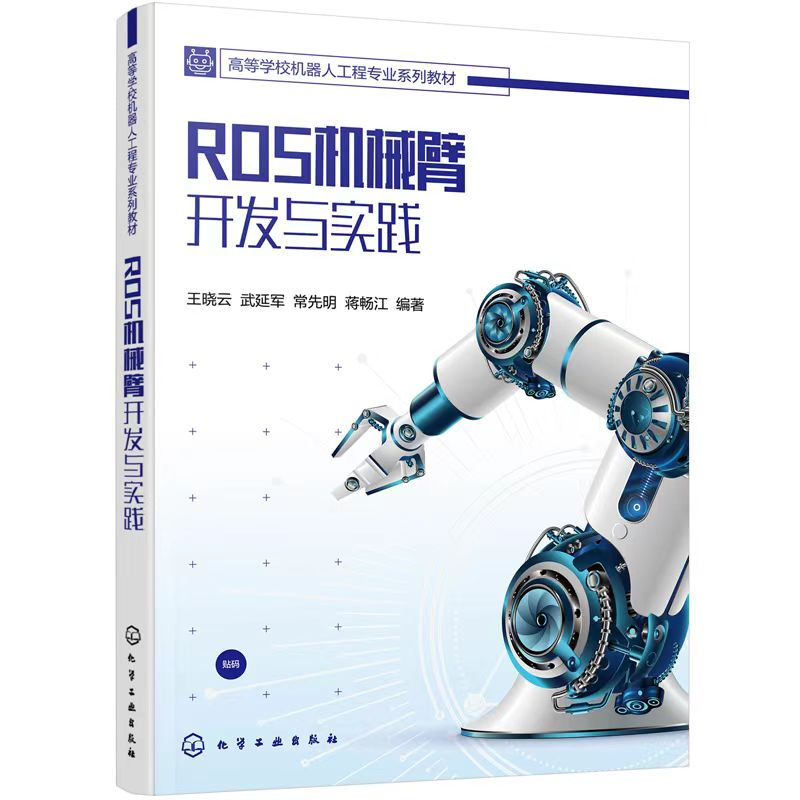

# 《ROS机械臂开发与实践》教材课后习题详解

欢迎使用《ROS机械臂开发与实践》教材，本书基于“如何从零开始搭建机械臂的 ROS 控制系统”这一问题，由浅入深，由易到难，理论结合实践，详细介绍了 ROS 机械臂开发过程中使用的技术，并通过大量原创工程实例，帮助读者深入理解 ROS 框架，学会将 ROS 和 MoveIt!应用到具体的机器人开发实践中。
本仓库是《ROS机械臂开发与实践》一书的课后习题讲解与课后题代码包，详情请参考本仓库文档“《ROS机械臂开发与实践》课后题答案”。

